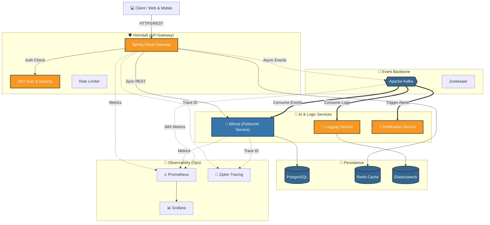

# 🌉 Asgard - Enterprise Microservices Platform

[](https://github.com/joeylife94/asgard)
[](LICENSE)
[](https://openjdk.org/projects/jdk/17/)
[](https://spring.io/projects/spring-boot)
[](https://www.python.org/)

> **A production-ready, cloud-native microservices platform built with Spring Boot and Python, featuring API Gateway, ML/AI services, and comprehensive observability.**

Named after the mythological realm connecting all worlds, **Asgard** serves as a unified platform connecting multiple microservices with enterprise-grade patterns including circuit breakers, distributed tracing, event-driven architecture, and real-time monitoring.

## 🎯 Project Overview

**Purpose**: Demonstrate enterprise-level microservices architecture with modern DevOps practices

**Tech Stack**:
- **Backend**: Spring Boot 3.2, Spring Cloud, gRPC
- **Message Broker**: Apache Kafka
- **Databases**: PostgreSQL, Redis, Elasticsearch
- **Monitoring**: Prometheus, Grafana, Zipkin
- **Container**: Docker, Docker Compose
- **Build**: Gradle Multi-Module

**Key Features**:
- ✅ API Gateway with authentication & rate limiting
- ✅ Event-driven architecture with Kafka
- ✅ Circuit breaker & resilience patterns
- ✅ Distributed tracing & metrics
- ✅ gRPC inter-service communication
- ✅ ML/AI service integration
- ✅ Comprehensive test coverage
- ✅ Production-ready configuration

## 🏗️ System Architecture



## 📦 Project Structure

```
asgard/
├── heimdall/          # Spring Boot API Gateway & Service
├── bifrost/           # Python ML/AI Service
├── docker-compose.yml # Local development infrastructure
├── monitoring/        # Monitoring configurations
├── build.gradle       # Root Gradle configuration
└── settings.gradle    # Gradle module settings
```

## 🚀 Quick Start

### Prerequisites

- Java 17+
- Gradle 8.5+
- Docker & Docker Compose
- Python 3.9+ (for Bifrost)
- Node.js 18+ (for Frontend)

### Option 1: One-Command Startup ⚡ (Recommended)

Start everything with a single command:

```powershell
# Start all services (Infrastructure + Heimdall + Bifrost + Frontend)
.\start-all.ps1

# With pre-build
.\start-all.ps1 -BuildFirst
```

### Option 2: Step-by-Step Setup 🔧

#### 1. Build All Services

```powershell
# Build everything (Java + Python + Frontend)
.\build-all.ps1

# Build without tests
.\build-all.ps1 -SkipTests

# Build without frontend
.\build-all.ps1 -SkipFrontend
```

#### 2. Start Infrastructure Services

Start Zookeeper, Kafka, Redis, PostgreSQL, and monitoring stack:

```powershell
# Start infrastructure only
.\start-dev.ps1

# OR manually with docker-compose
docker-compose up -d
```

Verify services are running:

```powershell
docker-compose ps
```

#### 3. Start Application Services

**Heimdall (API Gateway):**
```powershell
.\gradlew :heimdall:bootRun
```

**Bifrost (ML/AI Service):**
```powershell
cd bifrost
.\.venv\Scripts\Activate.ps1
python -m bifrost.main
```

**Frontend (Dashboard):**
```powershell
cd bifrost\frontend
npm run dev
```

### Option 3: Manual Build (Legacy)

```powershell
# Build all Gradle modules
./gradlew build

# Build specific module
./gradlew :heimdall:build
```

### 🧪 Running Tests

```powershell
# Run all tests (Java + Python + Frontend)
.\test-all.ps1

# Run tests with coverage
.\test-all.ps1 -Coverage

# Run specific service tests
.\test-all.ps1 -Service heimdall
.\test-all.ps1 -Service bifrost
.\test-all.ps1 -Service frontend

# Skip integration tests
.\test-all.ps1 -SkipIntegration
```

### 🛑 Stopping Services

```powershell
# Stop all services (apps + infrastructure)
.\stop-all.ps1

# Stop and remove data volumes
.\stop-all.ps1 -RemoveVolumes

# Force stop all processes
.\stop-all.ps1 -Force

# Stop infrastructure only
.\stop-dev.ps1
```

## 🌐 Access Services

### Application Services
- **Heimdall (API Gateway)**: http://localhost:8080
  - Health: http://localhost:8080/actuator/health
  - Metrics: http://localhost:8080/actuator/metrics
  
- **Bifrost (ML/AI Service)**: http://localhost:8000
  - Docs: http://localhost:8000/docs
  - Health: http://localhost:8000/health

- **Frontend (Dashboard)**: http://localhost:5173

### Infrastructure Services
- **Kafka UI**: http://localhost:8090
- **Redis Commander**: http://localhost:8081
- **Prometheus**: http://localhost:9090
- **Grafana**: http://localhost:3000 (admin/admin)
- **Zipkin**: http://localhost:9411

## 📚 Documentation

- [Quick Reference](QUICK_REFERENCE.md) - Command cheat sheet
- [Development Roadmap](ROADMAP.md) - Project roadmap and future plans
- [Configuration Summary](CONFIGURATION_SUMMARY.md) - All configurations explained
- [Contributing Guide](CONTRIBUTING.md) - How to contribute
- [Git Commit Guide](GIT_COMMIT_GUIDE.md) - Commit message conventions
- [Testing Guide](TESTING_GUIDE.md) - How to write and run tests

## 🛠️ Developer Experience

### Unified Scripts ⭐

Asgard provides unified scripts for seamless polyglot development:

| Script | Purpose | Example |
|--------|---------|---------|
| `build-all.ps1` | Build all services | `.\build-all.ps1 -SkipTests` |
| `test-all.ps1` | Run all tests | `.\test-all.ps1 -Coverage` |
| `start-all.ps1` | Start everything | `.\start-all.ps1 -BuildFirst` |
| `stop-all.ps1` | Stop everything | `.\stop-all.ps1 -RemoveVolumes` |
| `start-dev.ps1` | Infrastructure only | `.\start-dev.ps1` |
| `stop-dev.ps1` | Stop infrastructure | `.\stop-dev.ps1` |

### CI/CD Optimization 🚀

- **Smart Builds**: Only changed services are built
- **Parallel Execution**: Independent service builds run in parallel
- **Fast Feedback**: Reduced CI/CD time by 40-60% for partial changes
- **Monorepo-Aware**: Path filters for Heimdall, Bifrost, Frontend

## 🐳 Docker Compose Services

### Core Infrastructure

| Service | Port | Description |
|---------|------|-------------|
| Zookeeper | 2181 | Kafka coordination |
| Kafka | 9092 | Message broker |
| Kafka UI | 8090 | Kafka web interface |
| Redis | 6379 | Cache & session store |
| Redis Commander | 8081 | Redis web UI |
| PostgreSQL | 5432 | Primary database |
| Elasticsearch | 9200 | Search engine (optional) |

### Monitoring Stack

| Service | Port | Credentials | Description |
|---------|------|-------------|-------------|
| Prometheus | 9090 | - | Metrics collection |
| Grafana | 3000 | admin/admin | Metrics visualization |
| Zipkin | 9411 | - | Distributed tracing |

### Access URLs

- **Kafka UI**: http://localhost:8090
- **Redis Commander**: http://localhost:8081
- **Prometheus**: http://localhost:9090
- **Grafana**: http://localhost:3000
- **Zipkin**: http://localhost:9411
- **Heimdall API**: http://localhost:8080
- **Bifrost API**: http://localhost:8000

## 🏗️ Gradle Multi-Module Setup

### Root Configuration (`build.gradle`)

The root `build.gradle` defines:
- Common plugins (Spring Boot, Java, Lombok)
- Shared dependencies (Spring Web, Validation, Actuator, etc.)
- Common repositories (Maven Central)
- Dependency management (Spring Cloud BOM)

### Module Configuration

Each module only needs to define:
- Module-specific dependencies
- Custom plugins (e.g., Protobuf for gRPC)
- Special configurations

**Example** (`heimdall/build.gradle`):
```gradle
plugins {
    id 'com.google.protobuf' version '0.9.4'
}

dependencies {
    // Only module-specific dependencies
    implementation 'org.springframework.boot:spring-boot-starter-security'
    implementation 'org.springframework.kafka:spring-kafka'
    // ...
}
```

## 📝 Common Gradle Commands

```powershell
# Build all modules
./gradlew build

# Build specific module
./gradlew :heimdall:build

# Run tests
./gradlew test

# Run specific module tests
./gradlew :heimdall:test

# Clean build artifacts
./gradlew clean

# Run Spring Boot application
./gradlew :heimdall:bootRun

# Create bootJar
./gradlew :heimdall:bootJar

# Check for dependency updates
./gradlew dependencyUpdates
```

## 🛠️ Development Workflow

### Adding a New Module

1. Create module directory: `mkdir new-service`
2. Add to `settings.gradle`:
   ```gradle
   include 'new-service'
   ```
3. Create `new-service/build.gradle` with specific dependencies
4. Build: `./gradlew :new-service:build`

### Managing Dependencies

**Common dependencies** → Add to root `build.gradle` in `subprojects` block
**Module-specific dependencies** → Add to module's `build.gradle`

### Database Migrations

For PostgreSQL migrations, you can use Flyway or Liquibase (add to module dependencies).

## 🔧 Configuration

### Environment Variables

Create `.env` file (see `.env.example`):

```env
# Database
DB_HOST=localhost
DB_PORT=5432
DB_NAME=heimdall
DB_USER=asgard
DB_PASSWORD=asgard_password

# Redis
REDIS_HOST=localhost
REDIS_PORT=6379
REDIS_PASSWORD=redis_password

# Kafka
KAFKA_BOOTSTRAP_SERVERS=localhost:9092
```

### Application Properties

Each service has its own `application.yml` or `application.properties`:
- `heimdall/src/main/resources/application.yml`
- `bifrost/bifrost.yaml`

## 🧪 Testing

```powershell
# Run all tests
./gradlew test

# Run integration tests
./gradlew integrationTest

# Run with coverage
./gradlew test jacocoTestReport
```

## 🧪 Testing

### Quick Test

```powershell
# 전체 테스트 실행 (자동화 스크립트)
.\run-tests.ps1

# Unit 테스트만
.\gradlew.bat test

# 커버리지 포함
.\gradlew.bat test jacocoTestReport
```

### Stress Testing

```powershell
# K6 스트레스 테스트 (K6 설치 필요)
k6 run heimdall\src\test\k6\stress-test.js

# 높은 부하 테스트
k6 run --vus 200 --duration 5m heimdall\src\test\k6\stress-test.js
```

**상세 가이드**: [TESTING_GUIDE.md](TESTING_GUIDE.md)

## 📊 Monitoring

### Metrics

Spring Boot Actuator exposes metrics at:
- Heimdall: http://localhost:8080/actuator/prometheus

### Distributed Tracing

Zipkin collects traces from all services:
- Zipkin UI: http://localhost:9411

### Logs

View logs:
```powershell
# Docker services
docker-compose logs -f

# Specific service
docker-compose logs -f kafka

# Application logs
./gradlew :heimdall:bootRun
```

## 🐛 Troubleshooting

### Kafka Connection Issues

```powershell
# Check Kafka is running
docker-compose ps kafka

# View Kafka logs
docker-compose logs kafka

# Test connection
docker-compose exec kafka kafka-broker-api-versions --bootstrap-server kafka:29092
```

### Redis Connection Issues

```powershell
# Test Redis connection
docker-compose exec redis redis-cli -a redis_password ping
```

### PostgreSQL Connection Issues

```powershell
# Test PostgreSQL connection
docker-compose exec postgres psql -U asgard -d heimdall -c "SELECT 1"
```

## 🚢 Deployment

### Build Docker Images

Each service can be containerized:

```powershell
# Build Heimdall
cd heimdall
docker build -t asgard/heimdall:latest .

# Build Bifrost
cd bifrost
docker build -t asgard/bifrost:latest .
```

### Kubernetes Deployment

K8s manifests are available in:
- `heimdall/k8s/`
- `bifrost/k8s/`

Deploy with:
```bash
kubectl apply -f heimdall/k8s/
kubectl apply -f bifrost/k8s/
```

## 📚 Additional Documentation

- [Heimdall Architecture](heimdall/docs/HEIMDALL_ARCHITECTURE.md)
- [Bifrost Integration](bifrost/docs/ARCHITECTURE.md)
- [MSA Architecture](heimdall/docs/MSA_ARCHITECTURE.md)
- [gRPC Integration Guide](heimdall/docs/GRPC_INTEGRATION_GUIDE.md)

## 📄 License

See individual module LICENSE files.

## 🤝 Contributing

1. Create a feature branch
2. Make your changes
3. Run tests: `./gradlew test`
4. Submit a pull request

## 🔗 Links

- [Spring Boot Documentation](https://spring.io/projects/spring-boot)
- [Gradle Documentation](https://docs.gradle.org/)
- [Apache Kafka Documentation](https://kafka.apache.org/documentation/)
- [Redis Documentation](https://redis.io/documentation)
